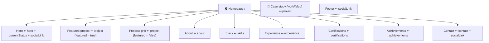
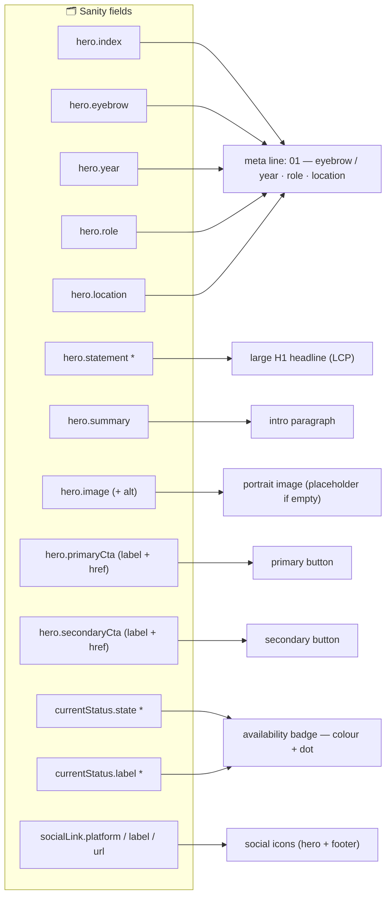
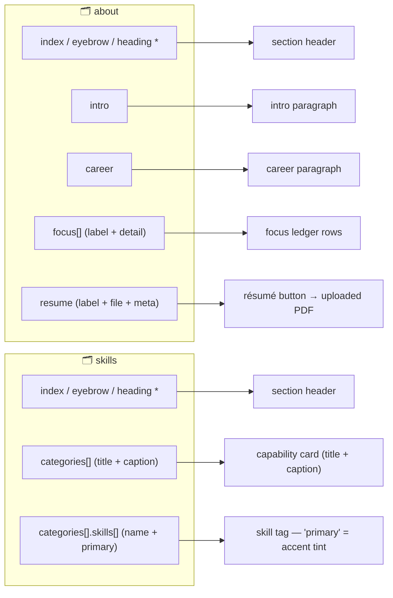
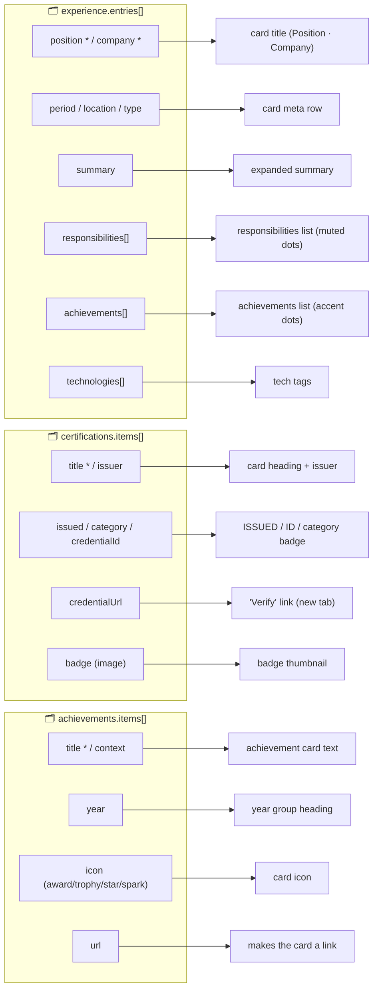
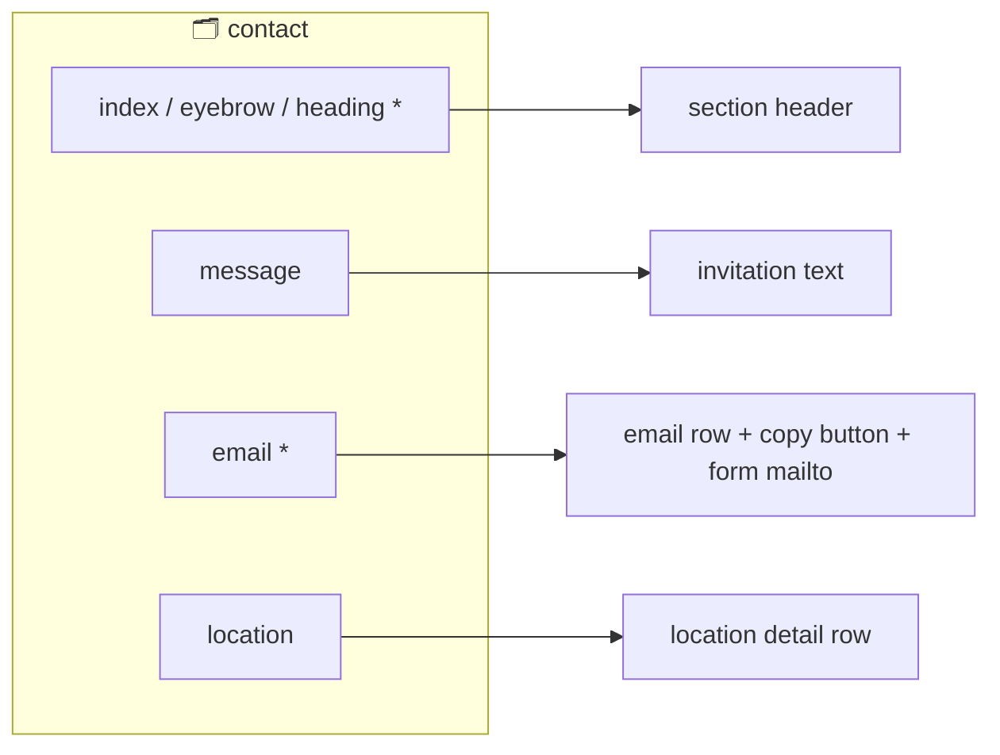
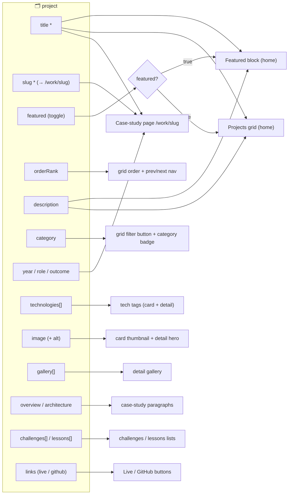

# Content map — Sanity fields ↔ website

A quick reference for maintaining the portfolio. **Read each mapping as: edit the
Sanity field (left) → it changes the website element (right).** `*` = required.

> Editing rules that always apply:
>
> 1. **Publish, don't just save** — the site only reads published content.
> 2. **Singletons** (Hero, Current status, About, Skills, Experience, Certifications,
>    Achievements, Contact) are one document each; **collections** (Projects, Social
>    links) hold many.
> 3. **A published singleton fully replaces the fallback** — fill every field you care
>    about or that spot goes blank.
> 4. Keep exactly **one** project with `featured = true`, and always set image **alt** text.

## 1. Page overview — which section comes from which document

## 2. Hero zone (hero + Current status + Social links)

## 3. About + Skills

## 4. Experience + Certifications + Achievements

## 5. Contact

## 6. Projects (one schema → three places)

---

**Source of truth:** schemas live in
[`src/sanity/schema/documents.ts`](../src/sanity/schema/documents.ts) and
[`objects.ts`](../src/sanity/schema/objects.ts); the GROQ that shapes them for the site is
in [`src/sanity/queries.ts`](../src/sanity/queries.ts).
